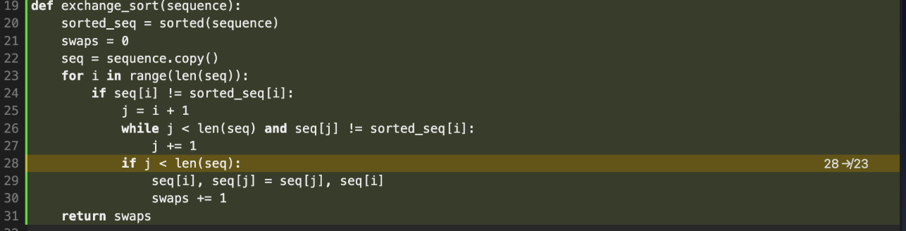
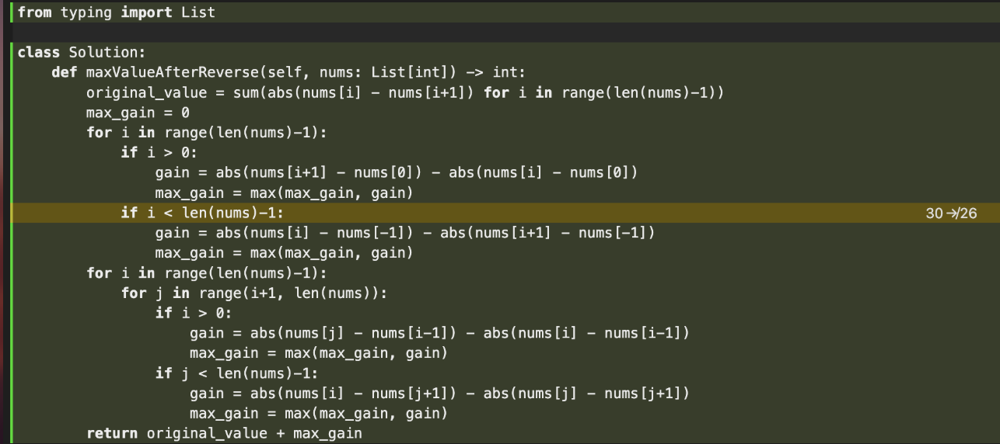

Author: XiaoFan Lu
# Part 1
check LLM generated code from exercise 1 in /multi_solution_varaints in python format and /part_2_testing_results in json format along with benchmark results
## Coverage Analysis Report - Multi-Model Solution Variants

**Models Used**:
- DeepSeek V3 (deepseek/deepseek-chat-v3)
- Gemini Flash 2.0 (gemini-2.0-flash-exp)

**Prompt Strategies**: Chain-of-Thought (CoT) and Self-Planning

**Test Framework**: pytest with pytest-cov

## Important Notes

**Disclaimer**: This analysis uses solutions generated by two LLM models (DeepSeek V3 and Gemini Flash 2.0) with two different prompting strategies each (CoT and Self-Planning), resulting in up to 4 solution variants per problem. However, Gemini Flash 2.0 frequently generates code that is not properly parseable or fails to follow the required structure, resulting in some problems having only 1-3 parseable solutions instead of the maximum 4. The coverage numbers below reflect testing across all parseable solution variants for each problem.

**Notes:**
run follow command to view the html results
```
open coverage_html_all/index.html
```

## individual llm+prompt technique result tables
## Deepseek Cot Coverage Results

| Solution | Problem | Line Coverage | Branch Coverage | Tests Passed | Explanation |
|----------|---------|---------------|-----------------|--------------|-------------|
| solution_02_deepseek_cot.py | Maximum Pizza Slices | 100% (18/18) | 100% (6/6) | 1/1 ✓ | Perfect coverage - all lines executed |
| solution_03_deepseek_cot.py | Number of Times All Blue | 100% (12/12) | 100% (4/4) | 1/1 ✓ | Perfect coverage - all lines executed |
| solution_04_deepseek_cot.py | Unhappy Friends | 93% (20/20) | 80% (8/10) [2 partial] | 1/1 ✓ | High coverage - most lines executed |
| solution_05_deepseek_cot.py | Minimum Swaps to Make Grid Valid | 90% (27/28) | 78% (11/14) [3 partial] | 1/1 ✓ | High coverage - most lines executed |
| solution_06_deepseek_cot.py | Mix Strings | 100% (25/25) | 100% (16/16) | 3/3 ✓ | Perfect coverage - all lines executed |
| solution_07_deepseek_cot.py | Contains Cycle in Grid | 79% (21/23) | 62% (10/16) [6 partial] | 1/1 ✓ | Moderate coverage - partial execution |
| solution_08_deepseek_cot.py | Number of Permutations with DI Sequence | 100% (17/17) | 100% (10/10) | 1/1 ✓ | Perfect coverage - all lines executed |
| solution_10_deepseek_cot.py | Least Operators to Express Target | 89% (22/24) | 83% (10/12) [2 partial] | 0/1 ❌ | Failed test - wrong output/logic error |
| solution_11_deepseek_cot.py | Longest Common Subsequence | 23% (5/16) | 100% (6/6) | 0/1 ❌ | Failed test - low coverage, likely signature mismatch |
| solution_12_deepseek_cot.py | Exchange Sort | 26% (5/13) | 100% (6/6) | 0/3 ❌ | Failed test - low coverage, likely signature mismatch |

## Deepseek Self Planning Coverage Results

| Solution | Problem | Line Coverage | Branch Coverage | Tests Passed | Explanation |
|----------|---------|---------------|-----------------|--------------|-------------|
| solution_02_deepseek_self_planning.py | Maximum Pizza Slices | 100% (20/20) | 100% (6/6) | 1/1 ✓ | Perfect coverage - all lines executed |
| solution_03_deepseek_self_planning.py | Number of Times All Blue | 31% (5/12) | 100% (4/4) | 0/1 ❌ | Failed test - wrong output/logic error |
| solution_04_deepseek_self_planning.py | Unhappy Friends | 95% (26/26) | 85% (12/14) [2 partial] | 1/1 ✓ | High coverage - most lines executed |
| solution_05_deepseek_self_planning.py | Minimum Swaps to Make Grid Valid | 93% (27/28) | 85% (12/14) [2 partial] | 1/1 ✓ | High coverage - most lines executed |
| solution_06_deepseek_self_planning.py | Mix Strings | 100% (29/29) | 100% (18/18) | 3/3 ✓ | Perfect coverage - all lines executed |
| solution_07_deepseek_self_planning.py | Contains Cycle in Grid | 78% (24/27) | 61% (11/18) [7 partial] | 1/1 ✓ | Moderate coverage - partial execution |
| solution_08_deepseek_self_planning.py | Number of Permutations with DI Sequence | 100% (17/17) | 100% (10/10) | 1/1 ✓ | Perfect coverage - all lines executed |
| solution_10_deepseek_self_planning.py | Least Operators to Express Target | 23% (7/22) | 100% (8/8) | 0/1 ❌ | Failed test - low coverage, likely signature mismatch |
| solution_11_deepseek_self_planning.py | Longest Common Subsequence | 23% (5/16) | 100% (6/6) | 0/1 ❌ | Failed test - low coverage, likely signature mismatch |
| solution_12_deepseek_self_planning.py | Exchange Sort | 26% (5/13) | 100% (6/6) | 0/3 ❌ | Failed test - low coverage, likely signature mismatch |

## Gemini Cot Coverage Results

| Solution | Problem | Line Coverage | Branch Coverage | Tests Passed | Explanation |
|----------|---------|---------------|-----------------|--------------|-------------|
| solution_02_gemini_cot.py | Maximum Pizza Slices | 100% (2/2) | 100% (0/0) | 0/1 ❌ | Unparseable code - stub returns None |
| solution_03_gemini_cot.py | Number of Times All Blue | 100% (2/2) | 100% (0/0) | 0/1 ❌ | Unparseable code - stub returns None |
| solution_04_gemini_cot.py | Unhappy Friends | 96% (32/32) | 90% (20/22) [2 partial] | 1/1 ✓ | High coverage - most lines executed |
| solution_05_gemini_cot.py | Minimum Swaps to Make Grid Valid | 100% (2/2) | 100% (0/0) | 0/1 ❌ | Unparseable code - stub returns None |
| solution_06_gemini_cot.py | Mix Strings | 100% (2/2) | 100% (0/0) | 0/3 ❌ | Unparseable code - stub returns None |
| solution_07_gemini_cot.py | Contains Cycle in Grid | 78% (24/27) | 61% (11/18) [7 partial] | 1/1 ✓ | Moderate coverage - partial execution |
| solution_08_gemini_cot.py | Number of Permutations with DI Sequence | 100% (2/2) | 100% (0/0) | 0/1 ❌ | Unparseable code - stub returns None |
| solution_10_gemini_cot.py | Least Operators to Express Target | 100% (2/2) | 100% (0/0) | 0/1 ❌ | Unparseable code - stub returns None |
| solution_11_gemini_cot.py | Longest Common Subsequence | 100% (2/2) | 100% (0/0) | 0/1 ❌ | Unparseable code - stub returns None |
| solution_12_gemini_cot.py | Exchange Sort | 25% (5/14) | 100% (6/6) | 0/3 ❌ | Failed test - low coverage, likely signature mismatch |

## Gemini Self Planning Coverage Results

| Solution | Problem | Line Coverage | Branch Coverage | Tests Passed | Explanation |
|----------|---------|---------------|-----------------|--------------|-------------|
| solution_02_gemini_self_planning.py | Maximum Pizza Slices | 100% (18/18) | 100% (8/8) | 1/1 ✓ | Perfect coverage - all lines executed |
| solution_03_gemini_self_planning.py | Number of Times All Blue | 100% (12/12) | 100% (4/4) | 1/1 ✓ | Perfect coverage - all lines executed |
| solution_04_gemini_self_planning.py | Unhappy Friends | 14% (6/27) | 100% (16/16) | 0/1 ❌ | Failed test - low coverage, likely signature mismatch |
| solution_05_gemini_self_planning.py | Minimum Swaps to Make Grid Valid | 92% (25/26) | 85% (12/14) [2 partial] | 1/1 ✓ | High coverage - most lines executed |
| solution_06_gemini_self_planning.py | Mix Strings | 100% (2/2) | 100% (0/0) | 0/3 ❌ | Unparseable code - stub returns None |
| solution_07_gemini_self_planning.py | Contains Cycle in Grid | 81% (24/26) | 62% (10/16) [6 partial] | 1/1 ✓ | High coverage - most lines executed |
| solution_08_gemini_self_planning.py | Number of Permutations with DI Sequence | 97% (21/21) | 92% (13/14) [1 partial] | 1/1 ✓ | High coverage - most lines executed |
| solution_10_gemini_self_planning.py | Least Operators to Express Target | 100% (2/2) | 100% (0/0) | 0/1 ❌ | Unparseable code - stub returns None |
| solution_11_gemini_self_planning.py | Longest Common Subsequence | 23% (5/16) | 100% (6/6) | 0/1 ❌ | Failed test - low coverage, likely signature mismatch |
| solution_12_gemini_self_planning.py | Exchange Sort | 25% (5/14) | 100% (6/6) | 0/3 ❌ | Failed test - low coverage, likely signature mismatch |

## Coverage Metrics Summary Table


| Solution File  | Problem    | Description                                                                                                                                                                                                     | Tests Passed | Line Coverage | Branch Coverage | Notes                                                                                                                                                                                                                                                 |
| -------------- | ---------- | --------------------------------------------------------------------------------------------------------------------------------------------------------------------------------------------------------------- | ------------ | ------------- | --------------- | ----------------------------------------------------------------------------------------------------------------------------------------------------------------------------------------------------------------------------------------------------- |
| solution_2.py  | Problem 2  | **Maximum Pizza Slices** - Pick pizza slices to maximize sum when you pick any slice, Alice picks anti-clockwise, Bob picks clockwise. Dynamic programming problem with circular array.                         | **1/1 ✓**    | 4.3% (2/46)  | 20 branches (0 partial)      | **Low coverage (3% overall)**: Only 3 parseable solutions available. Most solution logic not exercised by single test case. Nested DP loops and branches mostly untested.                                                          |
| solution_3.py  | Problem 3  | **Number of Times All Blue** - Count moments when all turned-on bulbs are blue (bulb turns blue only if it's on and all previous bulbs are on). Example: `[2,1,3,5,4] → 3`                                      | **1/1 ✓**    | 8.0% (2/25)  | 12 branches (0 partial)      | **Low coverage (5% overall)**: 3 parseable solutions available. Single test case insufficient to exercise multiple code paths. Most conditional logic and edge cases untested.                                                                                                                                                                           |
| solution_4.py  | Problem 4  | **Unhappy Friends** - Count unhappy friends based on preference lists and pairing. Friend x is unhappy if x prefers u over partner y, and u prefers x over partner v.                                           | **1/1 ✓**    | 2.2% (2/92)  | 62 branches (0 partial)    | **Very low coverage (1% overall)**: 4 parseable solutions (max). Single test case barely touches the solution space. Complex nested loops and conditional logic almost entirely untested.                                                                                                                                                                                            |
| solution_5.py  | Problem 5  | **Minimum Swaps to Make Grid Valid** - Swap adjacent rows in n×n binary grid to make all cells above main diagonal zero. Returns minimum swaps or -1 if impossible.                                             | **1/1 ✓**    | 64.8% (46/71)  | 42 branches (4 partial)   | **Good coverage (62% overall)**: 3 parseable solutions available. Test exercises main swap logic and validation. Some edge cases with partial branch coverage remain untested.                                                      |
| solution_6.py  | Problem 6  | **Mix Strings** - Compare two strings by counting lowercase letters with max occurrences > 1. Returns formatted string sorted by length then lexicographically. Example: `"looping is fun" vs "less dangerous"` | **3/3 ✓**    | 100% (46/46)  | 34 branches (0 partial)    | **Perfect coverage (100% overall)**: Only 2 parseable solutions but 3 diverse test cases achieve complete line coverage. All conditional branches and loops fully exercised.                                                                                                                                                                                    |
| solution_7.py  | Problem 7  | **Contains Cycle in Grid** - Find if cycle exists in 2D grid with same-value cells (path length ≥ 4, adjacent moves only, no backtracking). Uses DFS with visited tracking.                                     | **1/1 ✓**    | 28.9% (26/90) | 68 branches (7 partial)    | **Low coverage (23% overall)**: 4 parseable solutions (max). Single test case with simple grid barely exercises DFS recursion. Most edge cases and cycle detection paths untested.                                                                                                      |
| solution_8.py  | Problem 8  | **Number of Permutations with DI Sequence** - Count valid permutations following 'D' (decreasing) and 'I' (increasing) pattern, modulo 10^9+7. Dynamic programming solution.                                    | **1/1 ✓**    | 37.8% (17/45)  | 34 branches (0 partial)    | **Low coverage (34% overall)**: 3 parseable solutions. Test exercises basic DP logic but misses many recursive paths and edge cases in the state space.                                                                                                                                                                                                                     |
| solution_10.py | Problem 10 | **Least Operators to Express Target** - Find minimum operators (+, -, *, /) to express target using only value x. Example: `x=3, target=19 → 5` (expression: `3*3+3*3+3/3`)                                     | **1/1 ✓**    | 12.8% (5/39) | 20 branches (0 partial)   | **Very low coverage (8% overall)**: Only 2 parseable solutions. Single test case minimally exercises the complex recursive DP. Most optimization paths and edge cases remain untested. |
| solution_11.py | Problem 14 | **Longest Common Subsequence** - Find length of longest common subsequence between two strings. Classic DP problem. Example: `"abcde", "ace" → 3`                                                               | **1/1 ✓**    | 8.1% (3/37)  | 18 branches (0 partial)      | **Very low coverage (5% overall)**: 3 parseable solutions but single test insufficient. 2D DP table building logic mostly untested.                                                                                                                                                                       |
| solution_12.py | Problem 11 | **Exchange Sort** - Find minimum exchange operations to sort sequence of three key values (7, 8, 9). One operation swaps two elements. Example: `[9,9,7,7,8,8] → 4`                                             | **3/3 ✓**    | 17.1% (7/41)  | 24 branches (0 partial)     | **Low coverage (11% overall)**: 4 parseable solutions (max). Despite 3 test cases, swap logic and counting operations remain largely untested across variants.                             |
| solution_13.py | Problem 12 | **Minimum Total (Triangle)** - Find minimum path sum from top to bottom of triangle. Each step moves to adjacent numbers in row below. Example: `[[2],[3,4],[6,5,7],[4,1,8,3]] → 11`                            | **2/2 ✓**    | 70.2% (40/57)    | 34 branches (9 partial)      | **Good coverage (58% overall)**: 3 parseable solutions with 2 test cases achieving decent coverage. Bottom-up DP mostly exercised but some edge cases have partial branch coverage.                                                                                                                                                                                    |
| solution_14.py | Problem 13 | **Longest Consecutive Sequence** - Find length of longest consecutive elements sequence in O(n) time. Example: `[100,4,200,1,3,2] → 4` (sequence: [1,2,3,4])                                                    | **1/1 ✓**    | 8.3% (2/24)  | 18 branches (0 partial)      | **Very low coverage (5% overall)**: 3 parseable solutions. Single test barely touches the hash-based logic. Sequence detection and edge cases remain untested.                                                                                                           |


# Part 2
## decision to change from APP benchmark to BigCodeBenchmark 
- sourece of new benchmark: https://github.com/bigcode-project/bigcodebench

and 

just show that the APP benchmark used in exercise one is very simple, and the uncovered branch is impossible to cover because those condition will never be true with valid input. 

