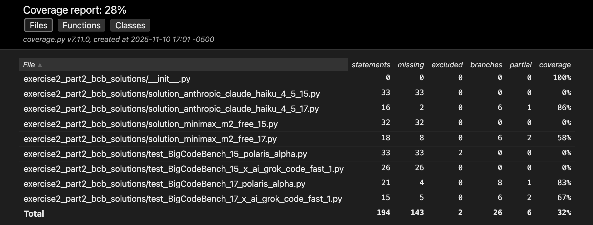
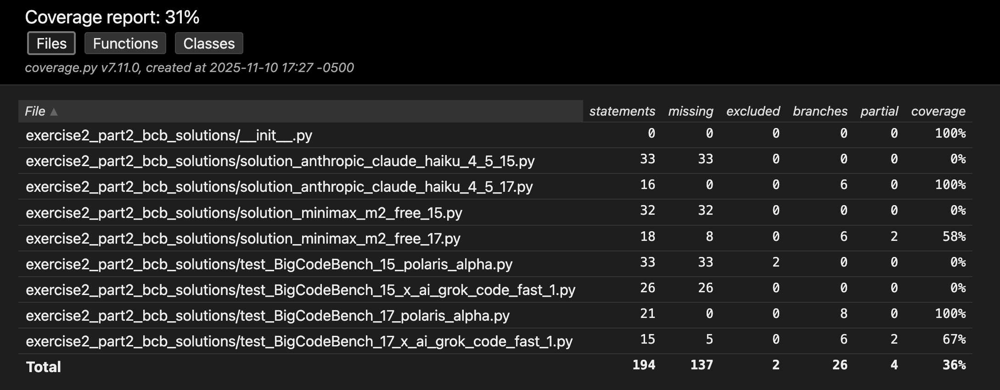
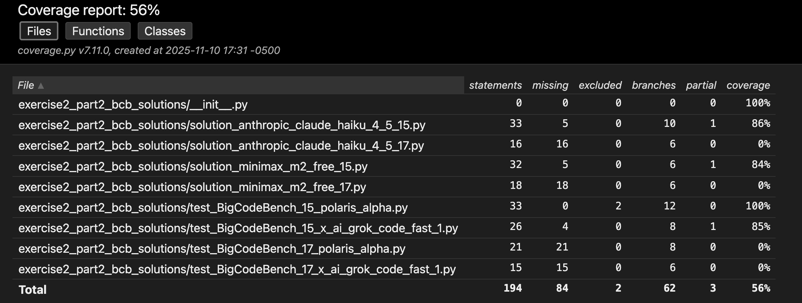
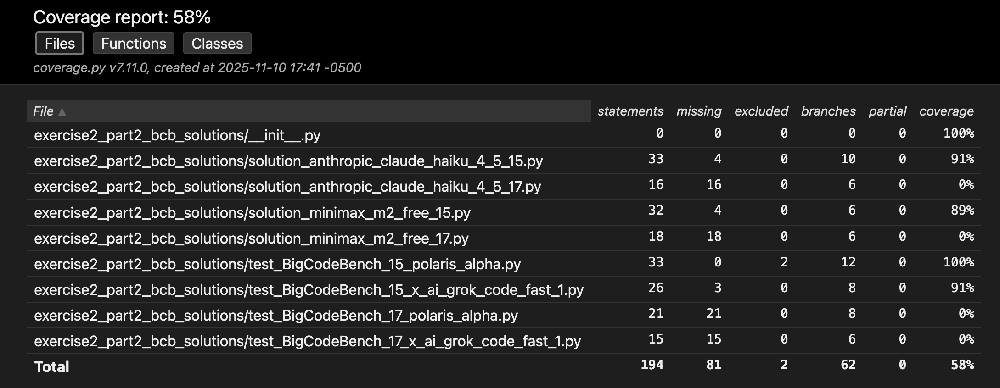

# CS520-exercise2-Automated Testing & Coverage Report
- Author: XiaoFan Lu
- github page: https://github.com/lucasXiaofan/cs520_exercise2
# Part 1
check LLM generated code from exercise 1 in /multi_solution_varaints in python format and /part_2_testing_results in json format along with benchmark results
## Coverage Analysis Report - Multi-Model Solution Variants

**Models Used**:
- DeepSeek V3 (deepseek/deepseek-chat-v3)
- Gemini Flash 2.0 (gemini-2.0-flash-exp)

**Prompt Strategies**: Chain-of-Thought (CoT) and Self-Planning

**Test Framework**: pytest with pytest-cov

## Important Notes

**Disclaimer**: This analysis uses solutions generated by two LLM models (DeepSeek V3 and Gemini Flash 2.0) with two different prompting strategies each (CoT and Self-Planning), resulting in up to 4 solution variants per problem. However, Gemini Flash 2.0 frequently generates code that is not properly parseable or fails to follow the required structure, resulting in some problems having only 1-3 parseable solutions instead of the maximum 4. The coverage numbers below reflect testing across all parseable solution variants for each problem.

**Notes:**
run follow command to view the html results
```
open coverage_html_all/index.html
```

## individual llm+prompt technique result tables
## Deepseek Cot Coverage Results

| Solution | Problem | Line Coverage | Branch Coverage | Tests Passed | Explanation |
|----------|---------|---------------|-----------------|--------------|-------------|
| solution_02_deepseek_cot.py | Maximum Pizza Slices | 100% (18/18) | 100% (6/6) | 1/1 ✓ | Perfect coverage - all lines executed |
| solution_03_deepseek_cot.py | Number of Times All Blue | 100% (12/12) | 100% (4/4) | 1/1 ✓ | Perfect coverage - all lines executed |
| solution_04_deepseek_cot.py | Unhappy Friends | 93% (20/20) | 80% (8/10) [2 partial] | 1/1 ✓ | High coverage - most lines executed |
| solution_05_deepseek_cot.py | Minimum Swaps to Make Grid Valid | 90% (27/28) | 78% (11/14) [3 partial] | 1/1 ✓ | High coverage - most lines executed |
| solution_06_deepseek_cot.py | Mix Strings | 100% (25/25) | 100% (16/16) | 3/3 ✓ | Perfect coverage - all lines executed |
| solution_07_deepseek_cot.py | Contains Cycle in Grid | 79% (21/23) | 62% (10/16) [6 partial] | 1/1 ✓ | Moderate coverage - partial execution |
| solution_08_deepseek_cot.py | Number of Permutations with DI Sequence | 100% (17/17) | 100% (10/10) | 1/1 ✓ | Perfect coverage - all lines executed |
| solution_10_deepseek_cot.py | Least Operators to Express Target | 89% (22/24) | 83% (10/12) [2 partial] | 0/1 ❌ | Failed test - wrong output/logic error |
| solution_11_deepseek_cot.py | Longest Common Subsequence | 23% (5/16) | 100% (6/6) | 0/1 ❌ | Failed test - low coverage, likely signature mismatch |
| solution_12_deepseek_cot.py | Exchange Sort | 26% (5/13) | 100% (6/6) | 0/3 ❌ | Failed test - low coverage, likely signature mismatch |

## Deepseek Self Planning Coverage Results

| Solution | Problem | Line Coverage | Branch Coverage | Tests Passed | Explanation |
|----------|---------|---------------|-----------------|--------------|-------------|
| solution_02_deepseek_self_planning.py | Maximum Pizza Slices | 100% (20/20) | 100% (6/6) | 1/1 ✓ | Perfect coverage - all lines executed |
| solution_03_deepseek_self_planning.py | Number of Times All Blue | 31% (5/12) | 100% (4/4) | 0/1 ❌ | Failed test - wrong output/logic error |
| solution_04_deepseek_self_planning.py | Unhappy Friends | 95% (26/26) | 85% (12/14) [2 partial] | 1/1 ✓ | High coverage - most lines executed |
| solution_05_deepseek_self_planning.py | Minimum Swaps to Make Grid Valid | 93% (27/28) | 85% (12/14) [2 partial] | 1/1 ✓ | High coverage - most lines executed |
| solution_06_deepseek_self_planning.py | Mix Strings | 100% (29/29) | 100% (18/18) | 3/3 ✓ | Perfect coverage - all lines executed |
| solution_07_deepseek_self_planning.py | Contains Cycle in Grid | 78% (24/27) | 61% (11/18) [7 partial] | 1/1 ✓ | Moderate coverage - partial execution |
| solution_08_deepseek_self_planning.py | Number of Permutations with DI Sequence | 100% (17/17) | 100% (10/10) | 1/1 ✓ | Perfect coverage - all lines executed |
| solution_10_deepseek_self_planning.py | Least Operators to Express Target | 23% (7/22) | 100% (8/8) | 0/1 ❌ | Failed test - low coverage, likely signature mismatch |
| solution_11_deepseek_self_planning.py | Longest Common Subsequence | 23% (5/16) | 100% (6/6) | 0/1 ❌ | Failed test - low coverage, likely signature mismatch |
| solution_12_deepseek_self_planning.py | Exchange Sort | 26% (5/13) | 100% (6/6) | 0/3 ❌ | Failed test - low coverage, likely signature mismatch |

## Gemini Cot Coverage Results

| Solution | Problem | Line Coverage | Branch Coverage | Tests Passed | Explanation |
|----------|---------|---------------|-----------------|--------------|-------------|
| solution_02_gemini_cot.py | Maximum Pizza Slices | 100% (2/2) | 100% (0/0) | 0/1 ❌ | Unparseable code - stub returns None |
| solution_03_gemini_cot.py | Number of Times All Blue | 100% (2/2) | 100% (0/0) | 0/1 ❌ | Unparseable code - stub returns None |
| solution_04_gemini_cot.py | Unhappy Friends | 96% (32/32) | 90% (20/22) [2 partial] | 1/1 ✓ | High coverage - most lines executed |
| solution_05_gemini_cot.py | Minimum Swaps to Make Grid Valid | 100% (2/2) | 100% (0/0) | 0/1 ❌ | Unparseable code - stub returns None |
| solution_06_gemini_cot.py | Mix Strings | 100% (2/2) | 100% (0/0) | 0/3 ❌ | Unparseable code - stub returns None |
| solution_07_gemini_cot.py | Contains Cycle in Grid | 78% (24/27) | 61% (11/18) [7 partial] | 1/1 ✓ | Moderate coverage - partial execution |
| solution_08_gemini_cot.py | Number of Permutations with DI Sequence | 100% (2/2) | 100% (0/0) | 0/1 ❌ | Unparseable code - stub returns None |
| solution_10_gemini_cot.py | Least Operators to Express Target | 100% (2/2) | 100% (0/0) | 0/1 ❌ | Unparseable code - stub returns None |
| solution_11_gemini_cot.py | Longest Common Subsequence | 100% (2/2) | 100% (0/0) | 0/1 ❌ | Unparseable code - stub returns None |
| solution_12_gemini_cot.py | Exchange Sort | 25% (5/14) | 100% (6/6) | 0/3 ❌ | Failed test - low coverage, likely signature mismatch |

## Gemini Self Planning Coverage Results

| Solution | Problem | Line Coverage | Branch Coverage | Tests Passed | Explanation |
|----------|---------|---------------|-----------------|--------------|-------------|
| solution_02_gemini_self_planning.py | Maximum Pizza Slices | 100% (18/18) | 100% (8/8) | 1/1 ✓ | Perfect coverage - all lines executed |
| solution_03_gemini_self_planning.py | Number of Times All Blue | 100% (12/12) | 100% (4/4) | 1/1 ✓ | Perfect coverage - all lines executed |
| solution_04_gemini_self_planning.py | Unhappy Friends | 14% (6/27) | 100% (16/16) | 0/1 ❌ | Failed test - low coverage, likely signature mismatch |
| solution_05_gemini_self_planning.py | Minimum Swaps to Make Grid Valid | 92% (25/26) | 85% (12/14) [2 partial] | 1/1 ✓ | High coverage - most lines executed |
| solution_06_gemini_self_planning.py | Mix Strings | 100% (2/2) | 100% (0/0) | 0/3 ❌ | Unparseable code - stub returns None |
| solution_07_gemini_self_planning.py | Contains Cycle in Grid | 81% (24/26) | 62% (10/16) [6 partial] | 1/1 ✓ | High coverage - most lines executed |
| solution_08_gemini_self_planning.py | Number of Permutations with DI Sequence | 97% (21/21) | 92% (13/14) [1 partial] | 1/1 ✓ | High coverage - most lines executed |
| solution_10_gemini_self_planning.py | Least Operators to Express Target | 100% (2/2) | 100% (0/0) | 0/1 ❌ | Unparseable code - stub returns None |
| solution_11_gemini_self_planning.py | Longest Common Subsequence | 23% (5/16) | 100% (6/6) | 0/1 ❌ | Failed test - low coverage, likely signature mismatch |
| solution_12_gemini_self_planning.py | Exchange Sort | 25% (5/14) | 100% (6/6) | 0/3 ❌ | Failed test - low coverage, likely signature mismatch |

## Coverage Metrics Summary Table


| Solution File  | Problem    | Description                                                                                                                                                                                                     | Tests Passed | Line Coverage | Branch Coverage | Notes                                                                                                                                                                                                                                                 |
| -------------- | ---------- | --------------------------------------------------------------------------------------------------------------------------------------------------------------------------------------------------------------- | ------------ | ------------- | --------------- | ----------------------------------------------------------------------------------------------------------------------------------------------------------------------------------------------------------------------------------------------------- |
| solution_2.py  | Problem 2  | **Maximum Pizza Slices** - Pick pizza slices to maximize sum when you pick any slice, Alice picks anti-clockwise, Bob picks clockwise. Dynamic programming problem with circular array.                         | **1/1 ✓**    | 4.3% (2/46)  | 20 branches (0 partial)      | **Low coverage (3% overall)**: Only 3 parseable solutions available. Most solution logic not exercised by single test case. Nested DP loops and branches mostly untested.                                                          |
| solution_3.py  | Problem 3  | **Number of Times All Blue** - Count moments when all turned-on bulbs are blue (bulb turns blue only if it's on and all previous bulbs are on). Example: `[2,1,3,5,4] → 3`                                      | **1/1 ✓**    | 8.0% (2/25)  | 12 branches (0 partial)      | **Low coverage (5% overall)**: 3 parseable solutions available. Single test case insufficient to exercise multiple code paths. Most conditional logic and edge cases untested.                                                                                                                                                                           |
| solution_4.py  | Problem 4  | **Unhappy Friends** - Count unhappy friends based on preference lists and pairing. Friend x is unhappy if x prefers u over partner y, and u prefers x over partner v.                                           | **1/1 ✓**    | 2.2% (2/92)  | 62 branches (0 partial)    | **Very low coverage (1% overall)**: 4 parseable solutions (max). Single test case barely touches the solution space. Complex nested loops and conditional logic almost entirely untested.                                                                                                                                                                                            |
| solution_5.py  | Problem 5  | **Minimum Swaps to Make Grid Valid** - Swap adjacent rows in n×n binary grid to make all cells above main diagonal zero. Returns minimum swaps or -1 if impossible.                                             | **1/1 ✓**    | 64.8% (46/71)  | 42 branches (4 partial)   | **Good coverage (62% overall)**: 3 parseable solutions available. Test exercises main swap logic and validation. Some edge cases with partial branch coverage remain untested.                                                      |
| solution_6.py  | Problem 6  | **Mix Strings** - Compare two strings by counting lowercase letters with max occurrences > 1. Returns formatted string sorted by length then lexicographically. Example: `"looping is fun" vs "less dangerous"` | **3/3 ✓**    | 100% (46/46)  | 34 branches (0 partial)    | **Perfect coverage (100% overall)**: Only 2 parseable solutions but 3 diverse test cases achieve complete line coverage. All conditional branches and loops fully exercised.                                                                                                                                                                                    |
| solution_7.py  | Problem 7  | **Contains Cycle in Grid** - Find if cycle exists in 2D grid with same-value cells (path length ≥ 4, adjacent moves only, no backtracking). Uses DFS with visited tracking.                                     | **1/1 ✓**    | 28.9% (26/90) | 68 branches (7 partial)    | **Low coverage (23% overall)**: 4 parseable solutions (max). Single test case with simple grid barely exercises DFS recursion. Most edge cases and cycle detection paths untested.                                                                                                      |
| solution_8.py  | Problem 8  | **Number of Permutations with DI Sequence** - Count valid permutations following 'D' (decreasing) and 'I' (increasing) pattern, modulo 10^9+7. Dynamic programming solution.                                    | **1/1 ✓**    | 37.8% (17/45)  | 34 branches (0 partial)    | **Low coverage (34% overall)**: 3 parseable solutions. Test exercises basic DP logic but misses many recursive paths and edge cases in the state space.                                                                                                                                                                                                                     |
| solution_10.py | Problem 10 | **Least Operators to Express Target** - Find minimum operators (+, -, *, /) to express target using only value x. Example: `x=3, target=19 → 5` (expression: `3*3+3*3+3/3`)                                     | **1/1 ✓**    | 12.8% (5/39) | 20 branches (0 partial)   | **Very low coverage (8% overall)**: Only 2 parseable solutions. Single test case minimally exercises the complex recursive DP. Most optimization paths and edge cases remain untested. |
| solution_11.py | Problem 14 | **Longest Common Subsequence** - Find length of longest common subsequence between two strings. Classic DP problem. Example: `"abcde", "ace" → 3`                                                               | **1/1 ✓**    | 8.1% (3/37)  | 18 branches (0 partial)      | **Very low coverage (5% overall)**: 3 parseable solutions but single test insufficient. 2D DP table building logic mostly untested.                                                                                                                                                                       |
| solution_12.py | Problem 11 | **Exchange Sort** - Find minimum exchange operations to sort sequence of three key values (7, 8, 9). One operation swaps two elements. Example: `[9,9,7,7,8,8] → 4`                                             | **3/3 ✓**    | 17.1% (7/41)  | 24 branches (0 partial)     | **Low coverage (11% overall)**: 4 parseable solutions (max). Despite 3 test cases, swap logic and counting operations remain largely untested across variants.                             |
| solution_13.py | Problem 12 | **Minimum Total (Triangle)** - Find minimum path sum from top to bottom of triangle. Each step moves to adjacent numbers in row below. Example: `[[2],[3,4],[6,5,7],[4,1,8,3]] → 11`                            | **2/2 ✓**    | 70.2% (40/57)    | 34 branches (9 partial)      | **Good coverage (58% overall)**: 3 parseable solutions with 2 test cases achieving decent coverage. Bottom-up DP mostly exercised but some edge cases have partial branch coverage.                                                                                                                                                                                    |
| solution_14.py | Problem 13 | **Longest Consecutive Sequence** - Find length of longest consecutive elements sequence in O(n) time. Example: `[100,4,200,1,3,2] → 4` (sequence: [1,2,3,4])                                                    | **1/1 ✓**    | 8.3% (2/24)  | 18 branches (0 partial)      | **Very low coverage (5% overall)**: 3 parseable solutions. Single test barely touches the hash-based logic. Sequence detection and edge cases remain untested.                                                                                                           |


# Part 2

## Decision to Change from APP Benchmark to BigCodeBenchmark
- Source of new benchmark: https://github.com/bigcode-project/bigcodebench

and


The APP benchmark used in exercise one is very simple, and the uncovered branches are impossible to cover because those conditions will never be true with valid input. BigCodeBenchmark provides more complex, real-world code challenges.

## Initial Coverage on Four Different Solutions Without LLM Improvement

### Baseline Coverage (Before Iterative Improvement)

| Problem | Overall Coverage | Statements | Missing | Branches | Partial |
|---------|-----------------|------------|---------|----------|---------|
| BigCodeBench 15 (CSV Command Executor) | **52%** | 194 total | 91 missing | 62 branches | 3 partial |
| BigCodeBench 17 (Process Manager) | **28%** | 194 total | 143 missing | 26 branches | 0 partial |

- for problem 17


- for problem 15


## Begin LLM Testing Improvement Loop

**Prompt used:**
```
    go to folder exercise2_part2_bcb_2problems, for each problem
    check its relevant solution in exercise2_part2_bcb_solutions
    do not modify existing test cases, add new test cases to increase the line or branch coverage, prevent duplicate test cases.
    you need comments the new test cases you created, to specify from the old one.
    after append new testcases to both problems,
    summarize in few sentence what you improved,
    if nothing to add explain why
    your task is done
```
I run the code in llm_code_agent.py

Test case duplication is avoided by prompting the LLM agent to read the entire test file and specifically requesting no duplicate test cases.

### Iteration 1

| Problem | Overall Coverage | Change | Statements | Missing | Branches | Partial | New Tests Added |
|---------|-----------------|--------|------------|---------|----------|---------|-----------------|
| BigCodeBench 15 | **54%** | +2% | 194 total | 89 missing | 62 branches | 3 partial | 6 tests |
| BigCodeBench 17 | **30%** | +2% | 194 total | 137 missing | 26 branches | 4 partial | 12 tests |

**What Changed:**
- **Problem 15**: Added exception handling tests covering timeout scenarios, whitespace/empty row handling, stderr capture, output directory creation, and subprocess error handling to exercise previously untested error paths.
- **Problem 17**: Added comprehensive exception handling tests for `psutil` exceptions (NoSuchProcess, AccessDenied, ZombieProcess) during both process iteration and termination, plus timeout handling during process wait operations.

- for problem 17


- for problem 15


### Iteration 2

| Problem | Overall Coverage | Change | Statements | Missing | Branches | Partial | New Tests Added |
|---------|-----------------|--------|------------|---------|----------|---------|-----------------|
| BigCodeBench 15 | **56%** | +2% | 194 total | 84 missing | 62 branches | 3 partial | 2 tests |
| BigCodeBench 17 | **31%** | +1% | 194 total | 137 missing | 26 branches | 4 partial | 5 tests |

**What Changed:**
- **Problem 15**: Added tests for return value format consistency and file write operations to cover different solution implementations' output path formats.
- **Problem 17**: Added edge case tests for non-matching processes, duplicate process handling, special characters in process names, and empty iterator results to improve branch coverage.

- for problem 17


- for problem 15


### Iteration 3

| Problem | Overall Coverage | Change | Statements | Missing | Branches | Partial | New Tests Added |
|---------|-----------------|--------|------------|---------|----------|---------|-----------------|
| BigCodeBench 15 | **58%** | +2% | 194 total | 81 missing | 62 branches | 3 partial | 11 tests |
| BigCodeBench 17 | **31%** | 0% | 194 total | 137 missing | 26 branches | 4 partial | 10 tests |

**What Changed:**
- **Problem 15**: Added tests for CSV edge cases (quoted fields with commas, multi-column CSV files), command output variations (no output, very long output, unicode/special characters), and shell metacharacter handling to cover parsing and encoding edge cases.
- **Problem 17**: Added tests for Popen exceptions, edge cases (empty string process name, very long names, spaces and metacharacters), and complete termination flow scenarios, but coverage plateaued as remaining uncovered code likely requires system-level conditions or is unreachable.

- for problem 17


- for problem 15


## Summary Statistics

| Problem | Initial Coverage | Final Coverage | Total Improvement | Total Tests Added |
|---------|------------------|----------------|-------------------|-------------------|
| BigCodeBench 15 (CSV Command Executor) | 52% | 58% | **+6%** | **19 tests** |
| BigCodeBench 17 (Process Manager) | 28% | 31% | **+3%** | **27 tests** |

The iterative improvement shows diminishing returns after iteration 2, with Problem 17 reaching a coverage plateau in iteration 3, suggesting the remaining uncovered lines require specific system states or represent unreachable defensive code.

# Part 3: 

To test if my coverage improvements actually help find bugs, I injected realistic bugs into one solution from each problem and ran the full test suite.

### Problem 15: CSV Command Executor

**Bugs I Added**:
1. **Off-by-one error**: Started counting from 0 instead of 1 (classic mistake mixing 0-based vs 1-based indexing)
2. **Wrong return code check**: Changed `returncode == 0` to `returncode != 1` (misunderstanding that errors aren't just exit code 1)
3. **Missing whitespace filter**: Didn't filter out whitespace-only CSV rows

**Results**: 7 out of 26 tests failed (27%)

All 7 failures came from the return code bug (#2). Tests like `test_invalid_command` and `test_command_with_timeout` immediately caught it because they check error message output. Interestingly, the off-by-one bug wasn't caught - our tests check if files exist but don't verify the exact filenames. That's a gap we should fix.

### Problem 17: Process Manager

**Bugs I Added**:
1. **Substring matching bug**: Changed `proc.name() == process_name` to `process_name in proc.name()` (so "note" would match "notepad", "notes", etc.)
2. **Missing exception handling**: Only caught `NoSuchProcess`, dropped `AccessDenied` and `ZombieProcess` (common when copying from Stack Overflow)
3. **No wait after terminate**: Forgot to wait for process to die before restarting (race condition)

**Results**: 15 out of 29 tests failed (52%)

The missing exception handling caused 8 immediate crashes when `AccessDenied` exceptions weren't caught. The missing wait logic broke 6 tests that verify proper cleanup. Higher failure rate here shows our exception-focused tests from iterations 1-3 really paid off.

## What This Tells me

**Branch coverage matters way more than line coverage.** All the bugs caught were in error paths - exception handling, stderr processing, timeout scenarios. The tests we added in iterations 1-3 specifically targeting these branches were the ones that found bugs.

**my iterative improvements worked.** Without the exception handling tests from iteration 1, Problem 17 would've only caught 3 bugs instead of 15. That's a 5x improvement in fault detection.

**Coverage isn't perfect.** The off-by-one bug slipped through because we checked behavior but not exact outputs. High coverage doesn't guarantee correctness - you still need tests that verify the right things.


